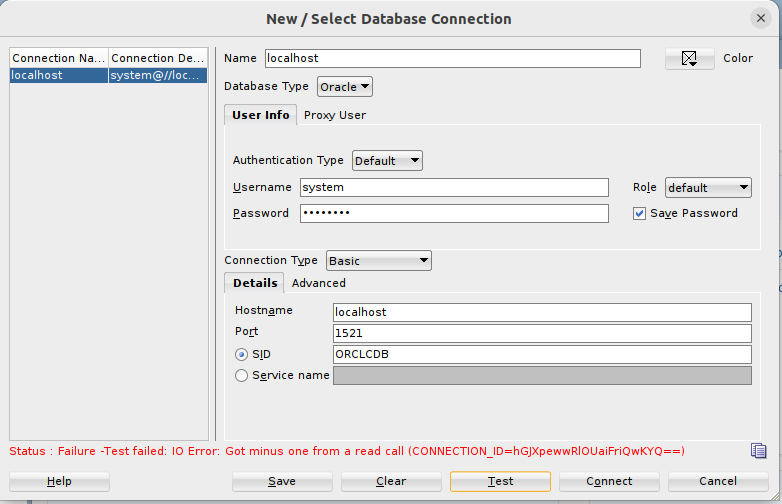
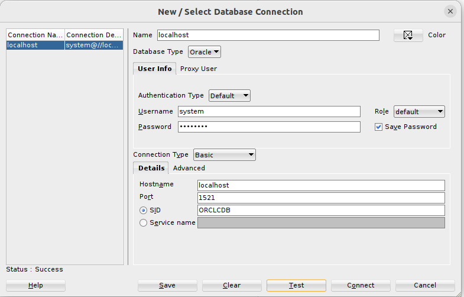

# Chapter 1.: Getting Started with Docker Oracle Database Image Builder

This project is based on [Github Oracle Docker Image Builder Scripts](https://github.com/oracle/docker-images/tree/main/OracleDatabase/SingleInstance).

Known issue for Oracle database docker container [ORA-12637: Packet receive failed](https://github.com/oracle/docker-images/blob/main/OracleDatabase/SingleInstance/FAQ.md#ora-12637-packet-receive-failed).

Prerequisite: [Docker](https://www.docker.com/) and [GitBash](https://git-scm.com/downloads)

## Step one: download Oracle Docker builder scripts

### `./import-ora-docker-image-builder-scripts.sh`

Now You have Oracle Docker builder scripts on Your local hard drive.

## Step two: download Oracle database installer file from Oracle website.

Get Oracle Database 19c for Linux x86-64 zip file from [Oracle Database Software Downloads](https://www.oracle.com/database/technologies/oracle-database-software-downloads.html).
You will need Oracle account, and You better accept Oracle License for Enterprise Edition.
Please move file LINUX.X64_193000_db_home.zip from your download folder here to folder 19-ee-installer-zip-folder/

## Step three: build docker image from Oracle zip installer with Oracle builder scripts

### `./build-ora-docker-image-19-ee.sh`

Builder process could take more than one minute.
Now You have Oracle Database Docker image built.
Verify image is present in your local docker repository.

### `docker image ls`

You should see repository **oracle/database** with tag **19.3.0-ee**

## Step four: tag and push docker image, (this step is optional)

### `./tag-ora-19-ee-bikewake.sh`

Tag prefix here is bikewake which is registration name in docker hub, so pushing with 

### `./push-ora-19-ee-bikewake.sh`

would work only if you have proper docker hub registration, please review scripts and use your own tag.

## Step five: download Oracle Sql Developer

Before starting database let's download [Oracle SQL Developer](https://www.oracle.com/database/sqldeveloper/)
We will verify database connection with Oracle Sql Developer shortly.

## Step six: run docker image with docker compose

### `cd bikewake-docker-compose`

Please review file docker-compose.yml, notice image tag rename it or leave it as bikewake,
in case you did not tag bikewake image in step four, bikewake/ora-database:19.3.0-ee would be downloaded from public docker hub repository.
Review password and SID for later login credentials in Sql Developer, review also docker volume name.
Now let's start database in the first terminal window run:

### `docker-compose up`

The first run could take more than minute, please wait until use see:

```
ora-database | #########################
ora-database | DATABASE IS READY TO USE!
ora-database | #########################
```

Let's start the second terminal window and run sql developer, try using login credentials, You could get ugly error after minute of timeout: 



Now open the third terminal window verify:

### `docker ps`

and see running container with name ora-database, now let's search for sqlnet.ora file in running container:

     docker exec ora-database ls ../../opt/oracle/oradata/dbconfig/ORCLCDB

Let's review sqlnet.ora file:

     docker exec ora-database cat  ../../opt/oracle/oradata/dbconfig/ORCLCDB/sqlnet.ora

Apply DISABLE_OOB=ON in sqlnet.ora file:

     docker exec ora-database "/bin/sh" -c "echo DISABLE_OOB=ON>>//opt/oracle/oradata/dbconfig/ORCLCDB/sqlnet.ora"

In the first terminal window where docker-compose is running press Ctrl-C to stop running container, You can remove container also with

### `docker-compose down`

Let's start it again 

### `docker-compose up`

You should see message DATABASE IS READY TO USE! much sooner now, try Test with SQL Developer and see Connection Success.



## Step seven: Clean up

Exit SQL Developer, In the first terminal window where docker-compose is running press Ctrl-C to stop running container,
and  remove container with:

### `docker-compose down`

Change folder back:

### `cd ..`

Delete docker images:

### `./clean-ora-bikewake-docker-image.sh`

Delete database docker volume data:

### `./clean-ora-bikewake-docker-volume.sh`

Delete Docker image builder scripts:

### `./clean-ora-builder-scripts-folder.sh`


## Step eight: Turn off computer, sleep for eight hours, and WAKE up for the next chapter tomorrow

[Chapter 2.: Automatic execution scripts on Startup/Setup Oracle Database](startup-setup-ora-bikewake-scripts)